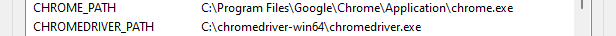

# ProjectG

Scraping public data off of dating websites to generate insights and create visualizations

# CURRENT SETUP PROCESS (10/9/24):
1. **Download selenium**, you can use pip if you have python installed:
    

    `pip install selenium`

  
2. **Download** [Chrome](https://www.google.com/chrome/) if you don't already have it.
    
    Open Chrome and paste this in the address bar: `chrome://settings/help` to get the version of Chrome. You'll need it for step 3.

3. **Download Chromedriver**. You likely have version `129.x.x.x`, if so you can use this [link](https://storage.googleapis.com/chrome-for-testing-public/129.0.6668.100/win64/chromedriver-win64.zip). Otherwise find the lastest version of Chromedriver for your installation of Chrome. For example, the lastest Chromedriver available for version `129.x.x.x` of Chrome is `129.0.6668.100`. You can use this [link](https://googlechromelabs.github.io/chrome-for-testing/known-good-versions-with-downloads.json) to find it.

4. **Create environment variables** on your machine for the file locations for chromedriver.exe and chrome.exe called *CHROMEDRIVER_PATH* and *CHROME_PATH* respectively. It should look something like this:

    

You are done with setup! &#x1F60E;

### GETTING THE BOT RUNNING
Now we need to get the bot up and running

1. Run the `start-chrome-session.bat` in the `scripts` folder. Follow the in structions in the command prompt. For now, TheBumbler&trade; is the bot that is most developed so go to Bumble.

2. Make an account, if you don't already have one. I know you have one &#x1F62D;
3. Run the python code and watch it go!